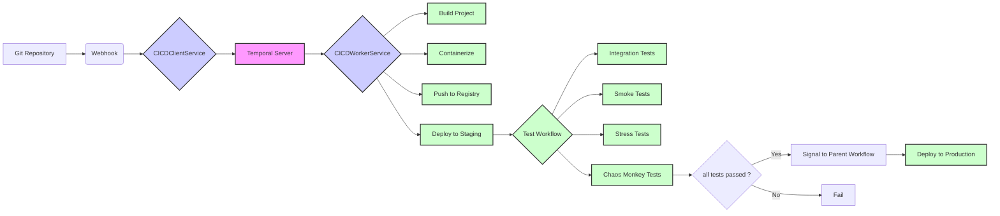

# CICD Pipeline Example

This project demonstrates the use of Temporal for building complex, reliable, and observable CICD pipelines. It includes services for running workflows, client interaction, and worker tasks.

## Temporal-Powered CICD Pipeline

This project demonstrates a Continuous Integration and Continuous Deployment (CICD) pipeline orchestrated by Temporal Workflow, showcasing the platform's capabilities and flexibility.

### Overview

This system automates the deployment process, triggered by Git repository events. It features a multi-stage pipeline that includes building, containerizing, testing, and deploying applications to both staging and production environments. The core of this system is driven by Temporal Workflow, which ensures reliability, observability, and maintainability.

### System Design

The CICD system is composed of three main services, each running within its own Docker container:

1.  **CICDClientService:** A Spring Boot application that exposes a REST API to trigger the CICD pipeline workflow. It acts as the entry point for the system, receiving Git webhook events.
2.  **CICDWorkerService:** A Spring Boot application that hosts the Temporal Activities and Workflows. These activities are the building blocks of the CICD pipeline, performing tasks like building code, running tests, and deploying applications.
3.  **CICDServer (Temporal):** The Temporal service that manages the workflow state, schedules activities, and ensures the overall execution of the CICD pipeline.

### System Architecture Diagram



## Prerequisites

Before setting up the project, make sure you have the following installed:

- Java 17+
- Maven
- Docker
- Temporal Server (installed locally or via Docker)
- Git Repository (to trigger the pipeline)

## Setup and Execution

### 1. Build the Project

Run the following command to build the project:

```bash
mvn clean package
```

### 2. Run Temporal Server

You can run the Temporal server in one of the following ways:

#### 2.1. Temporal Server (Local Development)

To run Temporal server for local development, use:

```bash
temporal server start-dev
```

#### 2.2. Temporal Server (Docker Container)

1. Navigate to the `cicd-server` directory:

    ```bash
    cd cicd-server
    ```

2. Build the Docker image:

    ```bash
    docker build -t cicd-server:latest .
    ```

3. Run the Docker container:

    ```bash
    docker run -p 8083:8080 cicd-server:latest
    ```

### 3. Run CICDClientService (Docker Container)

1. Navigate to the `cicd-client` directory:

    ```bash
    cd cicd-client
    ```

2. Build the Docker image:

    ```bash
    docker build -t cicd-client:latest .
    ```

3. Run the Docker container:

    ```bash
    docker run -p 8081:8080 cicd-client:latest
    ```

### 4. Run CICDWorkerService (Docker Container)

1. Navigate to the `cicd-worker` directory:

    ```bash
    cd cicd-worker
    ```

2. Build the Docker image:

    ```bash
    docker build -t cicd-worker:latest .
    ```

3. Run the Docker container:

    ```bash
    docker run -p 8082:8080 cicd-worker:latest
    ```

### 5. Trigger the Pipeline

1. Navigate to the sample Git event file:

    ```bash
    cd ./cicd-client/src/test/resources/request/
    ```

2. Send a POST request to the `CICDClientService` API:

    ```bash
    curl -X POST -H "Content-Type: application/json" -d @git-event.json http://localhost:8081/api/v1/cicd/pipeline
    ```

    > **Note**: Edit the `git-event.json` file to adapt it to your Git repository URL, add a namespace attribute, and modify it to be compatible with your Git account.

### 6. Monitor the Workflow

Open the Temporal Web UI in your browser:

```
http://localhost:8233/
```

Here, you can observe the execution of your workflow, check its status, view logs, and examine other details.

## Further Development

This project serves as a foundational example. Further development can include:

- **More Complex Activities**: Implement activities for database migrations, security scans, etc.
- **Error Handling**: Enhance error handling and retries within workflows and activities.
- **Dynamic Configuration**: Allow configuration to be dynamically loaded.
- **More Realistic Testing**: Enhance the test workflow with more diverse tests.
- **Security**: Add security features, such as authentication and authorization.
- **Rollback Strategy**: Implement a rollback to the last deployment in case of failure.
- **Approval Step**: Add an approval step before deployment to the production environment.

## Conclusion

This project demonstrates the power and flexibility of Temporal for building complex, reliable, and observable CICD pipelines. By using Temporal, you can easily orchestrate workflows and ensure that your deployments are consistently executed and monitored.
